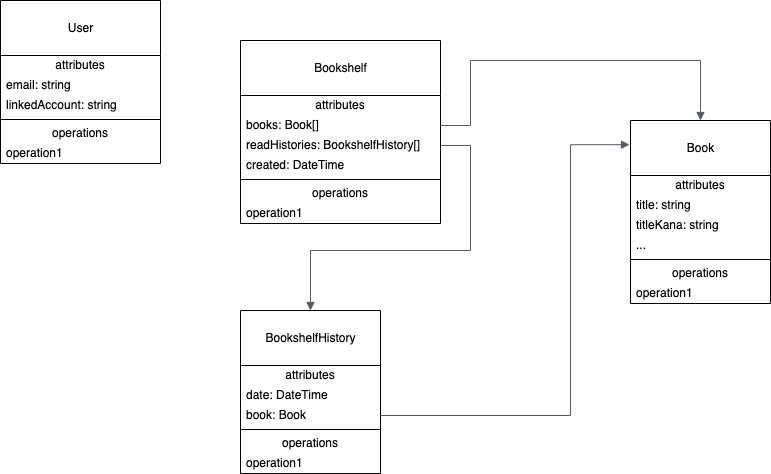

# picbook
## アプリ概要

### 画面設計(TBD)
- figma:ユーザーフロー
  - https://www.figma.com/file/LFlpRBi5CMWRJNMCnElqaY/picbook?node-id=15%3A95
  
### アーキテクチャ
`MVVM + Repository`パターンを採用する。

- ステートを持つPageは`HookConsumerWidget`もしくは`ConsumerWidget`を継承して作成する。
- ViewModelは`StateNotifier<T>`を継承して作成する。(命名はXXXNotifier)
- Repositoryはわかりやすく分離し、できれば外部のパッケージはDIしてRepository自体のテストも行う。

### スキーマ定義

- 図はdart上でのEntityとしての持ち方。
- 詳細なスキーマについては[docs/schema.yml](docs/schema.yml)を参照。

### フォルダ構成
```shell: lib/ > tree .
% tree . -I windows -I web -I ios -I macos -I linux -I android -I build
.
├── CHANGELOG.md # バージョンごとの変更点を記載していく
├── README.md # このドキュメント
├── analysis_options.yaml # lintの設定
├── docs # ドキュメント格納フォルダ
│   ├── modeling.drawio.png 
│   ├── schema.yml
│   └── schema_firebase.yml
├── lib
│   ├── common # domainでもinfrastructureでもpresentationでもないコードを置くところ
│   ├── domain 
│   │   ├── entity # entityモデルを置くところ
│   │   └── value # valueやenumを置くところ
│   ├── infrastructure # repositoryを置くところ
│   ├── main.dart # Flutterのエントリポイント
│   ├── presentation # presentationにViewとViewModel相当のコードを各画面ごとに置く
│   │   ├── book_detail
│   │   ├── bookshelf
│   │   ├── login
│   │   ├── mypage
│   │   ├── signin
│   │   └── splash
│   └── state # Stateを置くところ
├── picbook.iml
├── pubspec.lock
├── pubspec.yaml
└── test
    └── widget_test.dart
```

- firebase関連は[こちら](./firebase/README.md)を参照

## 開発の始め方
- リポジトリのクローン
```
# https
git clone -b main https://github.com/pj-picbook/picbook.git

# ssh
git clone -b main git@github.com:pj-picbook/picbook.git
```

- fvm install
```
fvm install
```

- freezedでクラスを定義orMockを新しく追加した後のコード生成コマンド
```
fvm flutter pub run build_runner build --delete-conflicting-outputs
```

### firebaseの設定ファイルをダウンロードしてローカルのプロジェクト内に配置
  - プロジェクトの設定からSDK設定用のファイルをダウンロードして、git cloneしたローカルプロジェクトのファイルの中に配置する
  - 理由としては、当該ファイルはpublicなリポジトリで見れないようにしており、gitigonoreしていて、個別対応が必要なため。
  - 設置しないとビルドエラーが起こる  

- android
  - ファイル名：google-services.json
  - 配置場所：android/app

- iOS
  - ファイル名：GoogleService-Info.plist
  - 配置場所：ios/Runner


### FVM（Flutter Version Management）のインストール方法
- Mac https://zenn.dev/riscait/articles/flutter-version-management
- Windows https://qiita.com/idani/items/0e45d037b4c2a93840a7

### 開発環境
```
% fvm flutter --version
Flutter 3.0.5 • channel stable • https://github.com/flutter/flutter.git
Framework • revision f1875d570e (3 days ago) • 2022-07-13 11:24:16 -0700
Engine • revision e85ea0e79c
Tools • Dart 2.17.6 • DevTools 2.12.2
```

## プロジェクト進行について

### 全体のタスク管理
- GitHub Projectsを用いて行う。カンバン方式
  - [ver 1.0](https://github.com/pj-picbook/picbook/projects/1)
- 初期資料
  - https://docs.google.com/spreadsheets/d/1l_Nu-918y9GVZ78cG5aG6ptdbY0iy-jf/edit#gid=1807751388

### Issueの立て方
New Issue をクリックすると 5 つのテンプレートがあります(salon_app の丸パクリ)  
それぞれ使い方や例が書いてあるのでそれにならって記載してください。  
質問なども Issue で立てていただけるとありがたいです

### ブランチ運用
Git Flow に沿って開発を行う(ツールは使わない)  
- 参考
  - [Git-flowって何？ - Qiita](https://qiita.com/KosukeSone/items/514dd24828b485c69a05)
  - [共同開発時のgithubの使い方（ブランチの作り方、マージの仕方、コンフリクトの解消方法）- vimeo(Flutter大学限)](https://vimeo.com/showcase/7431597/video/441969458)
- 基本的な流れ
  - main ブランチと develop ブランチが常に存在し、保護しておく
  - 機能を追加するときは develop ブランチから featureブランチを作成する
    - ブランチの名前は feature/#(issue 番号)\_わかりやすい名前
    - 作業が終わったら feature ブランチから develop ブランチへのPR(プルリクエスト)を作成する
    - PRを誰かがレビューし、LGTMが付けばMergeする
- 各ブランチについて
  - main
    - リリースされたアプリの状態と同期させる。直接の変更不可。PRからのマージのみ。
    - releaseブランチ or hotfixブランチからマージされ、バージョンが変更されるはずなので、mainへマージされた再はバージョンに合わせてタグを付与する
  - develop
    - 開発するためのブランチ。直接の変更不可。PRからのマージのみ。
    - developブランチでは常にビルドが通る状態にしておく。
  - feature
    - 機能追加の際に作成するブランチ。
    - developブランチから`feature/#{issue number}_{task name}`の命名規則でブランチを作成し、作業を行う。
    - PRはdevelopブランチをターゲットとする。
  - release
    - developブランチからmainブランチへ変更を取り込み、リリースを行う際に作成されるブランチ。
    - developブランチから`release/#{issue number}_{task name}`の命名規則でブランチを作成し、作業を行う。
    - PRはmainブランチをターゲットとする。
    - マージ後はリリース作業 & developブランチへもマージする。
  - hotfix
    - mainブランチで見つかったバグに対して修正したい場合に用いる
    - mainブランチから`hotfix/#{issue number}_{task name}`の命名規則でブランチを作成し、作業を行う。
    - PRはmainブランチをターゲットとする。
    - マージ後はリリース作業 & developブランチへもマージする。
- バージョニングについて
  - 一般的なセマンティックバージョニングを採用する
    - [セマンティック バージョニング 2.0.0 | Semantic Versioning](https://semver.org/lang/ja/)
  - 形式：`1.2.3` major.miner.patch
    - major
      - 大きな機能変更、後方互換性がない変更を行った際にインクリメントする
    - miner
      - 機能追加等の際にインクリメントする
    - patch
      - バグ修正などを行った場合にインクリメントする
      
## 開発Tips
- lintエラーの確認
```
fvm flutter analyze
```

- lintエラーの自動修正(手動で修正することを推奨)
```
# dry run
fvm dart fix --dry-run

# apply
fvm dart fix --apply
```

- テスト実行
```
fvm flutter test
```

- カバレッジ計測
```
# macの場合)
brew install lcov

fvm flutter test --coverage
genhtml coverage/lcov.info -o coverage/html
open coverage/html/index.html
```

### Firebase関連


## ビルド関連

### Android ビルドコマンド

コマンド叩く前に 「\android\app\src\development 」と「\android\app\src\production」に各環境の「google-services.json」を配置してください。
```
development
flutter build apk --debug --flavor development

production
flutter build apk --release --flavor production
```

### iOSビルドコマンド

 コマンド叩く前に
「Runner > Runner > Firebase 」に「GoogleService-Info-Development.plist」と「GoogleService-Info-Production.plist」を配置してください。
Firebaseのコンソールの各画面から「GoogleService-Info.plist」としてDLできるのでリネームをしてください。

```
development
flutter build ios --debug --flavor development

production
flutter build ios --release --flavor production
```
